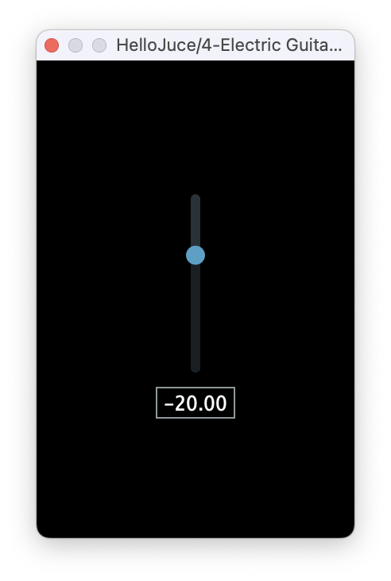

## HelloJuce

Code Repository for [Juce Tutorial 64 - Building Your First Plug-In (2020 Update)](https://www.youtube.com/watch?v=Bw_OkHNpj1M) by Joshua Hodge (from 'The Audio Programmer')

    

[⬇️ Download HelloJuce VST Plugin ](https://github.com/Digitopia/HelloJuce/releases/download/v1/HelloJuce.vst3.zip)
